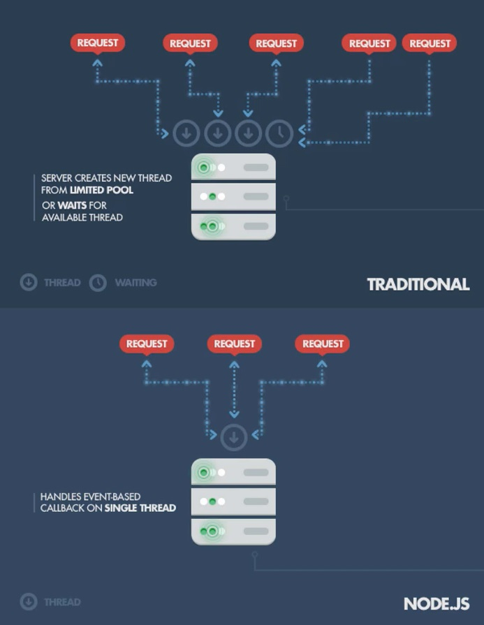

##
### Jornada JavaScript NodeJS
##

### 1 - INTRODUÇÃO AO NODEJS

**O que é o NodeJS?**
- É um ambiente de execução de JavaScript, de código aberto multiplataforma, que permite aos programadores executar código de JavaScript fora do tradicional ambiente de um broser
- Não é uma linguagem de programação
- Não é um framework de JavaScript
- Não é uma biblioteca para adicionar aos nossos projetos
- Com o NodeJS, podemos desenvolver aplicativos web FullStack em JavaScript, uma biblioteca ou framework de JS do lado do front-end e o NodeJs do back-end

**Como é possível a execução de JavaScript do lado do servidor?**
- O JavaScript foi criado para os browsers
- Os browsers têm motores de interpretação do JavaScript
- O NodeJS tem dentro de si motor V8 da Google
- Dessa forma permite interpretar JavaScript em qualquer ambiente onde esteja instalado
- Não vamos ter o DOM disponível
- Passamos a ter módulos que permitem manipular o file System, base de dados, etc...

**É importante aprender a usar o NodeJS?**
- Não é uma tecnologia obrigatória para desenvolver aplicação web
- É uma tecnologia com mais de 13 anos, e muito requerida no mercado
- Permite usar a mesma linguagem de programação no front-end e no back-end
- Estão sergindo várias tecnologias similares, Saber usar o NodeJS vai ajudar
- É uma tendência de mercado, As empresas valorizam experiência com NodeJS

**Ordem de trabalhos**
- Vamos começar por instalar o NodeJS
- Vamos criar pequenos exemplos de código
- Vamos aprender o básico da criação de um servidor NodeJS
    - Utilização de módulos
    - Módulo HTTP
    - Utilização do NPM
    - Trabalhar com file system
    - Acesso ao banco de dados MySQL
    - Acesso a base de dados MongoDB


### 2 - INSTALAÇÃO E PRIMEIROS TESTES COM NODEJS

- Ex: node-02

**NodeJS**
- Downloads (LTS) Version
- Long Time Suport
- Site: https://nodejs.org/en/

**Terminal, (Prompt de Comando, Git Bash, PowerShell)**
- Verificar a versão do node instalado

```
node -v
```

**Packages**
- Verificar a versão do NPM instalado
```
npm -v
```

- Comando para o node interpretar codigo javascript no console
```
node app.js
```

- Arquivo `app.js`
```js
//app.js
console.log("Olá Mundo do NodeJS.");
```

**Modo interativo (NodeJS)**

```
node
```

- Comando `.help`
- `.break` - Sometimes you get stuck, this gets you out
- `.clear` - Alias for .break
- `.editor` - Enter editor mode
- `.exit` - Exit the REPL
- `.help` - Print this help message
- `.load` - Load JS from a file into the REPL session
- `.save` - Save all evaluated commands in this REPL session to a file


### 3 - VAMOS CRIAR UM SERVIDOR COM NODEJS

- Ex: node-03

- Exemplo 1
```
node teste-server.js
```

- Exemplo 2
```
node server.js
```

- Exemplo 3
```
node server-three.js
```

- Localhost: http://localhost:3000/


### 4 - SERVIDOR COM DIFERENTES RESPOSTAS

- Ex: node-04


### 5 - ALGUNS CONCEITOS DE NODEJS PARA PROGRAMADORES PHP

- Ex: node-05

<p align="center">
  
</p>


### 6 - GLOBAL OBJECT

- Ex: node-06


### 7 - INTRODUÇÃO A MÓDULOS E REQUIRE

- Ex: node-07

- Roda o projeto (terminal)
```
node main.js
```


### 8 - REQUIRE E DESESTRUTURAÇÃO

- Ex: node-08

- Roda o projeto (terminal)
```
node main.js
```

### 9 - INTRODUÇÃO AOS MÓDULOS BUILTIN DO NODE

- Ex: node-09

**Node.js Built-in Modules**
- Site: https://www.w3schools.com/nodejs/ref_modules.asp


### 10 - LER FICHEIROS COM O MÓDULO FILE SYSTEM

- Ex: node-10

- Roda o projeto (terminal)
```
node app.js
```

### 11 - LER FICHEIROS DE FORMA SINCRONA E ESCRITA DE FICHEIROS

- Ex: node-11

- Roda o projeto (terminal)
```
node app.js
```


### 12 - CRIAR E REMOVER PASTAS

- Ex: node-12

- Roda o projeto (terminal)
```
node app.js
```

### 13 - ELIMINAR FICHEIROS

- Ex: node-13

- Roda o projeto (terminal)
```
node app.js
```

### 14 - STREAMS

- Ex: node-14

- Roda o projeto (terminal)
```
node app.js
```

<p align="center">
  
</p>

### 15 - STREAM WRITE

- Ex: node-15

- Roda o projeto (terminal)
```
node app.js
```

### 16 - VAMOS VOLTAR AO SERVIDOR

- Ex: node-16

- Roda o projeto (terminal)
```
node server.js
```

- Cliente
- Servidor

- Mostra o endereço `ip`
```
ping google.com
```
- Porta
  - 20 21 = FTP (file transfer protocol)
  - 22 = Security shell ussh
  - 53 = DNS
  - 80 = Protocolo HTTP
  - 443 = HTTP Security
  - 587 = Protocolo SMTP
  - 3389 = RDP
  - 3306 = Comunicação com servidores MySQL

### 17 - RELEMBRANDO AS RESPOSTAS

- Ex: node-17

- Roda o projeto (terminal)
```
node server.js
```

### 18 - RESPONDER COM UMA PÁGINA HTML COMPLETA

- Ex: node-18

- Roda o projeto (terminal)
```
node server.js
```

- http://localhost:3000/


### 19 - SISTEMA DE ROTAS SIMPLES

- Ex: node-19

- Roda o projeto (terminal)
```
node server.js
```

- http://localhost:3000/
- http://localhost:3000/about
- http://localhost:3000/404


### 20 - RESPONSE STATUS CODE

- Ex: node-20

- Roda o projeto (terminal)
```
node server.js
```

<p align="center">
  
</p>

<p align="center">
  
</p>

- http://localhost:3000/
- http://localhost:3000/about
- http://localhost:3000/404


### 21 - REDIRECTS

- Ex: node-21

- Roda o projeto (terminal)
```
node server.js
```
- http://localhost:3000/
- http://localhost:3000/about
- http://localhost:3000/acerca_de
- http://localhost:3000/404


### 22 - NPM E NODEMON COM INSTALAÇÃO GLOBAL

- Ex: node-22

- Roda o projeto (terminal)
```
node server.js
```
- http://localhost:3000/
- http://localhost:3000/about
- http://localhost:3000/acerca_de
- http://localhost:3000/404

**NODE PACKAGE MANEGER (npm)**

**NPM**
- Site: https://www.npmjs.com/

**Nodemon**
- Simple monitor script for use during development of a Node.js app.
- Site: https://www.npmjs.com/package/nodemon

**Express**
- Site: https://www.npmjs.com/package/express

**Node.JS**
- Site: https://nodejs.org/en/

- Verifica se o `npm` esta instalado
```
npm -v
```

**Instalação Global**
- Nodemon
```
npm install -g nodemon
```

- Roda o projeto com `nodemon`
```
nodemon server.js
```

- Problema com o Nodemon (Politicas de Segurança do Windows)
```
Set-ExecutionPolicy - Scope CurrentUser Unrestricted
```

### 23 - NPM WATCH, PACKAGE JSON E MAIS SOBRE NPM

- Ex: node-23

- Roda o projeto com `nodemon`
```
nodemon server.js
```
- http://localhost:3000/
- http://localhost:3000/about
- http://localhost:3000/acerca_de
- http://localhost:3000/404


- Roda o projeto com node `watch` (Experimental)
- ExperimentalWarning: Watch mode is an experimental feature and might change at any time
- (Use `node --trace-warnings ...` to show where the warning was created)
```
node --watch server.js
```

**Desinstalando o Nodemon**
- `Globalmente`
```
npm uninstall -g nodemon
```

- Verifica a versão do `Nodemon` instalado
```
nodemon -v
```

- `Limpar` o terminal
```
clear
```

**package.json**
- Criar o arquivo `package.json`
```
npm init
```

- `Executar` o servidor
```
npm start
```

**Adicionando uma dependência ao projeto**
- NPM 
  - Site: https://www.npmjs.com/

- Search: `lodash`
  - Lodash: https://www.npmjs.com/package/lodash
  - Doc: https://lodash.com/
  - Random: https://lodash.com/docs/4.17.15#random


- Instalar o lodash no projeto
- Cria os arquivos`node_modules`, `package-lock.json`

```
npm i lodash
```

- Roda o projeto 
```
node server.js
```

### 24 - LODASH, NODE MODULES E OPERAÇÕES COM O NPM

- Ex: node-24

- Instalando o Nodemon (dentro de `node_modules`)
```
npm i nodemon
```

- Roda o projeto com `nodemon`
```
nodemon server.js
```
- http://localhost:3000/
- http://localhost:3000/about
- http://localhost:3000/acerca_de
- http://localhost:3000/404

**Git**
- Sistema de versionamento
- Instalando o git
  - Site: https://git-scm.com/downloads

- Git Bash
- Verifica a versão do Git instalado
```
git -v
```

- Cria um repositorio local (dentro de `node_modules`, `.git`) 
```
git init
```

**.gitignore**
- Criar o arquivo `.gitignore` na raiz do projeto
- Ignora todo os arquivos selecionados no repositorio

- Arquivo `.gitignore`
```js
/*.gitignore*/
node_modules/
```

- Restaurando o `node_modules` a partir do `package.json`
```
npm install
```

### 25 - EXPRESSJS INTRODUÇÃO

- Ex: node-25

- npmjs
  - Site: https://www.npmjs.com/

- Express
  - Site: https://www.npmjs.com/package/express


- Instalar o express
```
npm install express
```

- Roda o projeto
```
node --watch app.js
```

- http://localhost:3000/
- http://localhost:3000/about


### 26 - EXPRESSJS - RESPOSTAS COM FICHEIROS HTML

- Ex: node-26

- Roda o projeto
```
node --watch app.js
```

- http://localhost:3000/
- http://localhost:3000/about


### 27 - EXPRESSJS - REDIRECTS & ERRO 404

- Ex: node-27

- Roda o projeto
```
node --watch app.js
```

- http://localhost:3000/
- http://localhost:3000/services
- http://localhost:3000/about


- http://localhost:3000/acerda-de
  - Redicet about

- http://localhost:3000/404
  - Erro 404


### 28 - EXPRESSJS - INTRODUÇÃO AO USO DE UM TEMPLATE ENGINE

- Ex: node-28

- Roda o projeto
```
node --watch app.js
```

- http://localhost:3000/
- http://localhost:3000/services
- http://localhost:3000/about


- http://localhost:3000/acerda-de
  - Redicet about

- http://localhost:3000/404
  - Erro 404


**TEMPLATE ENGINE**

- PUG
  - Site: https://www.npmjs.com/package/pug
  - Site: https://pugjs.org/api/getting-started.html

- JavaScript templating
  - Dot: https://www.npmjs.com/package/dot
  - Site: https://olado.github.io/doT/index.html

- Embedded JavaScript templates
  - Site: https://www.npmjs.com/package/ejs
  - Site: https://ejs.co/

- Instalando o EJS
```
npm install ejs
```

- http://localhost:3000/teste-ejs


### 29 - EXPRESSJS COMO PASSAR E APRESENTAR VALORES NAS VIEWS DO EJS

- Ex: node-29

- Roda o projeto
```
node --watch app.js
```

- http://localhost:3000/
- http://localhost:3000/services
- http://localhost:3000/about
- http://localhost:3000/teste-ejs

- Title dinâmico

- `F2` = Renomer  pasta


### 30 - EXPRESSJS APRESENTAÇÃO DE COLEÇÕES DE RESULTADOS NO EJS

- Ex: node-30

- Roda o projeto
```
node --watch app.js
```

- http://localhost:3000/
- http://localhost:3000/services
- http://localhost:3000/about
- http://localhost:3000/teste-ejs

- Instalação de extenção VSCode
  - `EJS language support`


### 31 - EXPRESSJS EJS VIEW PARTIALS

- Ex: node-31

- Roda o projeto
```
node --watch app.js
```

- http://localhost:3000/
- http://localhost:3000/services
- http://localhost:3000/about
- http://localhost:3000/teste-ejs


### 32 - EXPRESSJS INTRODUÇÃO AO CONCEITO DE MIDDLEWARE

**Conceito de Middleware**

- São partes do código que são executadas entre o request e o envio das respostas

<p align="center">
  
</p>


<p align="center">
  
</p>

- Ultimo comando não será executado

**Exemplos de Middleware**

- Registro de logs
- Funcionalidades de autenticação / autorização
- Validação e preparação de dados JSON a partir do request
- Responder com erros da aplicação


- Ex: node-32

- Roda o projeto
```
node --watch app.js
```

- http://localhost:3000/
- http://localhost:3000/services
- http://localhost:3000/about
- http://localhost:3000/teste-ejs


### 33 - EXPRESSJS - MAIS ALGUNS DETALHES SOBRE

- Ex: node-33

- Roda o projeto
```
node --watch app.js
```

- http://localhost:3000/
- http://localhost:3000/services
- http://localhost:3000/about
- http://localhost:3000/teste-ejs